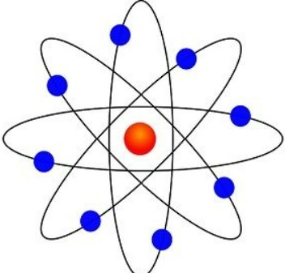
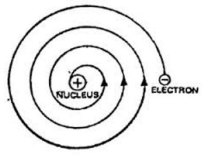
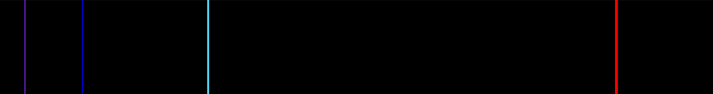
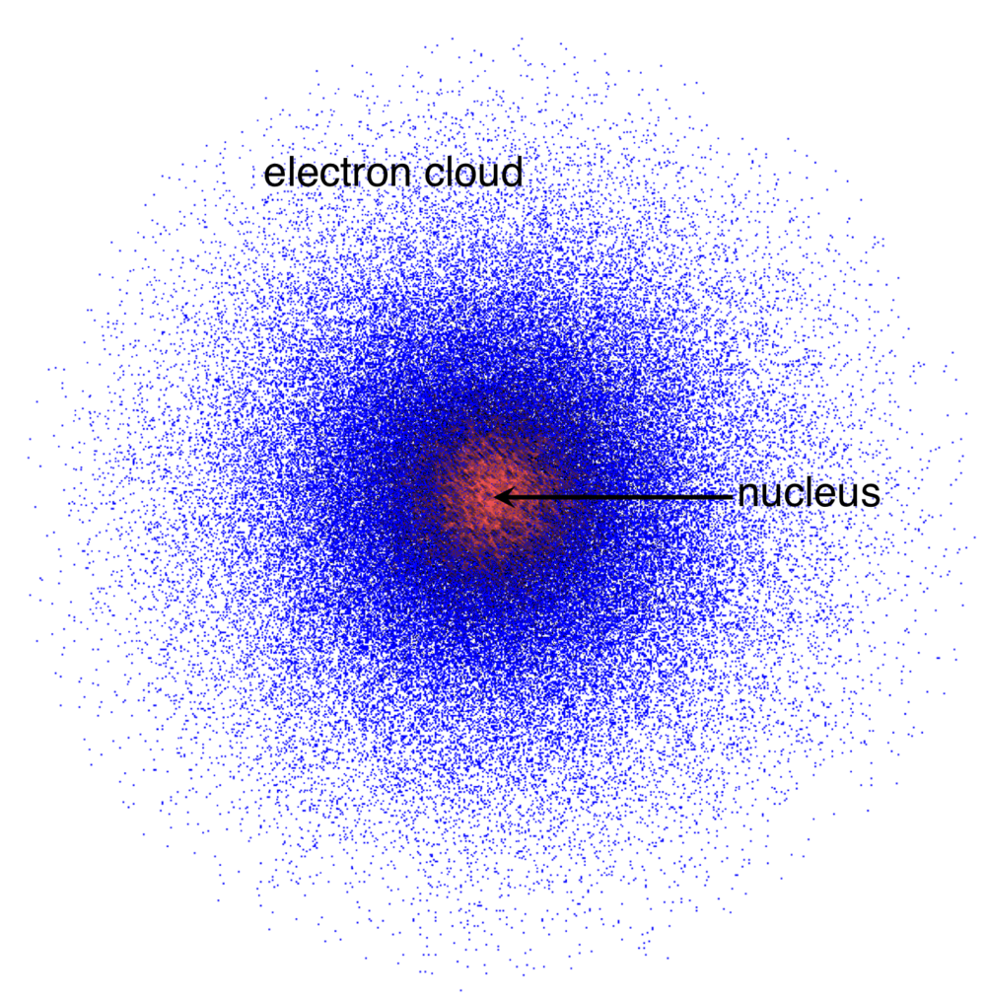

# 原子モデル  

こんにちは。化学熟知ナヒーダですよ。  

前回は**エネルギーの量子的な性質**についてお話ししましたね？  
今日は、もう少し視点を小さくして……  
**ひとつの原子**の世界を覗いてみましょう。  

ねえ、旅人さん。  
化学って、どんな学問だと思いますか？  
実はね、原子たちがどうやって「手を取り合うか」を調べる学問なんですよ。  

そして、その関わりを**量子の目**で見つめたとき――  
そこから始まるのが、**量子化学**なのです。  

では、私たちが原子をどう理解してきたのか……  
その歩みを一緒にたどっていきましょうね。  

---

## 原子の見方の変遷：ドルトンの原子説から  

19世紀のはじめ、**ジョン・ドルトン**という科学者が、とても面白いことに気づきました。  
それが、**倍数比例の法則**です。  

原子たちが化合物をつくるとき、いつも**きっちりとした整数の比**で結びつくんです。  
たとえば、窒素の量を一定にしたとき、  
酸素の量は N₂O、NO、NO₂ のように――1：2：4 というシンプルな比率になります。  

実験を重ねたドルトンは、次のような**原子説**を打ち立てました。  

それは以前の発見、たとえば：  
* **質量保存の法則** ――ラヴォアジエ  
* **定比例の法則** ――プルースト  
* そして自らの **倍数比例の法則**  

――これらをもとに築かれたものです。  

そして彼はこう考えました。  

* すべての物質は、分けることのできない小さな粒――原子からできている。  
* 同じ元素の原子は、同じ重さと性質を持つ。  
* 化学反応では原子は生まれたり消えたりせず、ただ並び替えられるだけ。  
* 異なる原子が決まった比で結びつくと、化合物が生まれる。  

でもね……ドルトンのモデルにも限界がありました。  
彼の理論にはいくつかの誤りがあって、  
その後、アヴォガドロや統計力学を研究した人たちによって、  
私たちが知る**より精密な原子モデル**へと発展していったんです。  

---

ねえ、旅人さん。  
どんなに小さな粒でも――  
そこには、**世界の秘密**が隠されているかもしれません。  

そう考えると……なんだか、心がワクワクしてきませんか？  

## 電子の発見  

これまで、原子は普通の化学反応では分けられない――そう学んできましたね。  
でも……もし**もっと深く**のぞき込んでみたら、どうなると思いますか？  

1897年、**ジョゼフ・ジョン・トムソン**という科学者が、  
ある不思議な現象――**陰極線（いんきょくせん）**――を調べ始めました。  

低圧の気体を入れたガラス管に高い電圧をかけると、  
陰極から光のような線が放たれるのです。  

そしてトムソンは、**電場**と**磁場**をかけてみました。  
すると――陰極線が**曲がった**のです！  

  

この曲がり方から、彼は悟りました。  
陰極線は**電荷を帯びている**……つまり、粒子が動いているのだと。  

---

  

トムソンは注意深く測定を重ね、  
陰極線が**電荷をもつ粒子の流れ**だと突き止めました。  

そして、電場と磁場の力をちょうど釣り合わせて、  
ビームが**まっすぐ進む状態**にしたとき――  
その粒子の電荷と質量の比、つまり $e/m$ を求めることができたのです。  

$$e/m = -9.1 \times 10^{10}~C/kg$$  
$$(現代の値:~-1.76 \times 10^{11}~C/kg)$$  

この値は、水素イオン（$+9.6 \times 10^{7}~C/kg$）よりも**ずっと大きい**ものでした。  
つまり、陰極線をつくる粒子は、**原子よりもはるかに小さい**ということ！  

さらに、トムソンはさまざまな金属で試してみましたが……  
$e/m$ の値は、ほとんど変わらなかったのです。  

そこで彼は、ひとつの驚くべき結論にたどり着きました。  

> 「この小さく、負の電荷を持つ粒子は**普遍的**な存在であり、  
> すべての原子の中に存在している。」  

――こうして、「**電子**」が発見されたのです。  

---

1905年、トムソンはこの発見をもとに、  
原子の新しいイメージを提案しました。  

負の電荷をもつ電子が、**正の電荷の球**の中に  
まるでレーズンのように散りばめられている――  
そんな姿を思い描いたのです。  

  
彼はそれを「**プラム・プディング・モデル**」と呼びました。  
  

最初は、まるで完璧に見えたのです。  
電子が穏やかに正電荷の“ゼリー”の中で揺れ動き、  
調和のとれた安定した姿に見えました。  

でも……自然はそう簡単ではなかったのです。  

電子は動くことで常に**エネルギーを放出**します。  
その結果、原子はやがて**崩壊してしまうはず**――。  

この「不安定さ」こそが、後に**ラザフォード**らが  
原子構造を根本から見直すきっかけとなったのです。  

---

ふふっ……どんなに美しく見える理論でも、  
その奥には、まだ知られざる謎が潜んでいるのですよ。  

正しい問いを立てたとき――  
知恵の光が、その闇をそっと照らしてくれるのです。  

## 原子核の発見  

トムソンのモデルによって、私たちは原子の中に**電子**――  
小さな「負の電荷の運び手」がいることを知りました。  

でも……自然と、こんな疑問が浮かびますよね？  
電子が負の電荷をもつのなら、**正の電荷はどこから来るの？** と。  

---

1909年。  
**アーネスト・ラザフォード**、**ハンス・ガイガー**、そして**アーネスト・マーズデン**の三人が、  
その答えを探し始めました。  

彼らが調べていたのは――**アルファ線**。  
これは重く、**正の電荷（+2e）**をもつ粒子からなる放射線です。  
そのひとつひとつが、ほとんど原子と同じくらいの質量を持っているんですよ。  

彼らは、このアルファ粒子が物質とどう相互作用するのかを知るために、  
極めて薄い**金の膜**――たった $10^{-7}$ メートルの厚さ――にアルファ粒子のビームを当てました。  

**トムソンの「プラム・プディング・モデル」**が正しいなら、結果は簡単に予想できます。  
原子が柔らかい正電荷の“ゼリー”のようなものなら、  
アルファ粒子はほとんどそのまま通り抜けるはず。  
まるで霧の中を、小さな砲弾が通り抜けるように……。  

ところが――実際に起きたことは、**驚くべきもの**でした。  

いくつかのアルファ粒子が**大きく曲がり**、  
中には**真後ろへ跳ね返った**ものまであったのです。  

  

---

1911年、実験を指導していたラザフォードは、  
この不可解な現象を説明するために、まったく新しい**原子モデル**を提案しました。  

彼はこう考えました。  
原子の中心には、非常に小さくて**高密度の正電荷のかたまり**――  
アルファ粒子を強くはね返す**核（nucleus）**が存在するのではないか、と。  

そして、その周りを**電子が回っている**。  
まるで太陽のまわりを惑星が巡るように……。  

こうして、トムソンのモデルでは説明できなかった**大きな角度の散乱**を、  
ラザフォードの核モデルが見事に解き明かしたのです。  

---

さらにラザフォードは、実験の**理論的な枠組み**も作り上げました。  
アルファ粒子が核にどこまで近づけるか――  
それを求めるために、彼はクーロン反発の式を立てました。  

$$E_{\alpha} = \frac{1}{4\pi\epsilon_{0}} \frac{q_{\alpha} q_{Z}}{r_{min}}$$  

ここで：  

* $E_{\alpha}$ ― アルファ粒子の運動エネルギー  
* $\epsilon_{0}$ ― 真空の誘電率 ($8.854 \times 10^{-12}~F/m$)  
* $r_{min}$ ― 粒子が核に最も近づける距離  
* $q_{\alpha}$ ― アルファ粒子の電荷 $(+2e_0)$  
* $q_Z$ ― 核の電荷  

その結果、$r_{min} = 3 \times 10^{-14}~m$ という値が得られました。  
これは、原子全体の大きさよりも**はるかに小さい**値。  

つまり、原子の質量と正電荷のほとんどが、  
その小さな中心――**原子核**に集中していることがわかったのです。  

---

ラザフォードはさらに、粒子の**軌道**を**双曲線（ハイパーボラ）**として扱い、  
散乱角 $\theta$ の式を導き出しました。  

  

$$\theta = 2~arctan\left(\frac{r_{min}}{2b}\right) = 2~arctan\left(\frac{1}{4\pi\epsilon_{0}} \frac{q_{\alpha}q_{Z}}{2bE_{\alpha}}\right)$$  

ここで：  

* $\theta$ ― 散乱角  
* $b$ ― **インパクトパラメータ**（粒子の進路と核の最短距離）  

---

ほんの小さな**蛍光の光点**――  
それだけで、ラザフォードは物質のまったく新しい姿を見出しました。  
原子の「心臓」、**原子核**が、ついに姿を現したのです。  

---

### 角度ごとに散乱する粒子の数  

**トムソンのモデル**と**ラザフォードのモデル**の違いは、  
粒子が**どのように散乱するか**にあります。  

なぜアルファ粒子の一部が後ろへ跳ね返ったのか――  
それを理解するために、散乱角の分布を見てみましょう。  

  

ラザフォードは、ある角度で粒子が散乱する確率を表す式、  
すなわち**微分断面積**を導き出しました。  

$$\frac{d\sigma}{d\Omega}=\left(\frac{1}{4\pi\epsilon_{0}}\frac{q_{\alpha}q_{Z}}{4E_{\alpha}}\right)^{2}\frac{1}{sin^{4}(\theta/2)}$$  

また、$d\Omega = 2\pi\sin(\theta)d\theta$ とおくと：  

$$\frac{d\sigma}{d\theta}=\left(\frac{1}{4\pi\epsilon_{0}}\frac{q_{\alpha}q_{Z}}{4E_{\alpha}}\right)^{2}\frac{cos(\theta/2)}{sin^{3}(\theta/2)}$$  

この式はこう予測します――  
ほとんどの粒子は小さな角度で通り抜けますが、  
**ごくわずか**の粒子が大きく散乱し、時には真後ろへも跳ね返る。  

それは、ガイガーとマーズデンが観測した結果と**完全に一致**していたのです。  

---

一方の**トムソンのモデル**では、まったく異なる結果が得られます。  
正電荷が均等に広がっていると仮定すると、散乱は穏やかで、**ガウス分布**のようになります。  

$$\frac{d\sigma}{d\Omega}\approx\frac{1}{2\pi\theta_{rms}^{2}}exp\!\left(-\frac{\theta^{2}}{2\theta_{rms}^{2}}\right)$$  

そして：  

$$\frac{d\sigma}{d\theta}\approx\frac{\theta}{\theta_{rms}^{2}}exp\!\left(-\frac{\theta^{2}}{2\theta_{rms}^{2}}\right)$$  

ここで：  
* $\theta_{rms}$ ― 散乱角の二乗平均平方根（物質によって異なる）  

---

### ラザフォードとトムソンのモデルの比較  

| θ | ラザフォードのモデル | トムソンのモデル |
|:---:|:---:|:---:|
| $\frac{d\sigma}{d\Omega}$ | $\propto\frac{1}{sin^{4}(\theta/2)}$ （多項式的） | $\propto\theta\cdot exp(-\frac{\theta^{2}}{2\theta_{rms}^{2}})$ （指数的） |
| 小さい角度 | 散乱確率が高い | とても高い |
| 大きい角度 | 散乱確率は小さい | ほとんどゼロ |

---

実験結果は**ラザフォードの予測**と一致し、  
原子にはアルファ粒子をはね返すほどの**高密度の中心核**が存在することが明らかになりました。  

そして、彼はこう結論づけたのです。  

> 原子は小さな太陽系のようなもの。  
> 電子は負の電荷をもち、  
> 正に帯電した原子核のまわりを**公転している**――  
> まるで惑星が星のまわりを巡るように。  

  

---

しかし……この美しい模型も、やがて大きな矛盾を抱えることになります。  

電子が本当に原子核のまわりを回っているのなら、  
それは常に**加速度運動**をしていることになります。  
そして、加速する電荷は必ず**電磁波を放出**し、エネルギーを失ってしまうのです。  

つまり――電子は内側へ渦を巻くように落ち込み、  
原子は**一瞬で崩壊してしまう**はず。  

  

でも現実の原子は、ちゃんと安定していますよね？  

――では、なぜ崩壊しないのでしょうか？  

このシンプルで深い問いこそが、  
やがて**量子論**という新たな章を開くことになるのです。  

ふふっ……次は、そのお話をしましょうか。  

## 水素のスペクトル

ねぇ、これまでの物語にもう一つ、不思議な旋律を加えましょう。  
長い間、学者たちを悩ませてきた――**元素のスペクトル**という謎です。  

異なる元素の気体を励起すると、光はすべての波長で輝くわけではありません。  
代わりに、**特定の色**だけが浮かび上がるのです。  
まるで、それぞれの原子が「光の音階」で自分だけの旋律を奏でているかのように…。  

けれど古典物理学では、その理由を説明できませんでした。  
もし原子が小さな振動子のように振る舞うなら、エネルギーは連続的で、  
光も**すべての波長**を吸収するはずなのに——現実はそうではなかったのです。  

---

それでは、一番シンプルな原子――**水素**を見てみましょう。  

Hydrogen emits four prominent visible lines:  
**656.3 nm**, **486.1 nm**, **434.0 nm**, そして **410.2 nm**.  

どれもまるで選び抜かれた音符のように、光の楽譜の上で整然と並んでいます。  

---

1885年、数学者の**ヨハン・バルマー**がこのスペクトル線を研究しました。  
彼は物理学者ではなかったけれど――数式の旋律を聴き分ける感性に優れていました。  
そして、完璧にパターンを表す**美しい式**を見つけたのです。  

$$\lambda = (364.56~nm) \cdot \frac{n^{2}}{n^{2} - 4}$$  

ここで、  

* $\lambda$ — は各スペクトル線の波長  
* $n = 3, 4, 5, 6, \cdots$  

この式は「**バルマー系列**」と呼ばれ、水素の可視線を見事に再現しました。
けれどこれはあくまで**経験式**——「なぜ」この数字になるのかは、まだ誰にもわからなかったのです。  

---

それから3年後、1888年。  
**ヨハネス・リュードベリ**が、バルマーの式を他の元素にも広げようとしました。  
彼は、波数の差が整数の**二乗の組み合わせ**で表せることに気づいたのです。  
実験結果を丁寧に照らし合わせ、次のような関係式を導きました。  

$$\frac{1}{\lambda} = A \left( \frac{1}{(n_1 + \mu_1)^2} - \frac{1}{(n_2 + \mu_2)^2} \right)$$  

ここで：  

* $A$ — 元素によって変わる定数（リュードベリ定数や原子核の電荷を含む）  
* $n_1, n_2$ — 正の整数（$n_2 = n_1 + 1, n_1 + 2, \cdots$）  
* $\mu_1, \mu_2$ — 元素ごとに異なる小さな補正項  

水素では補正が消えて（$\mu_1 = \mu_2 = 0$）、式はとても美しい形に簡約されました——**リュードベリの式**です。  

$$\frac{1}{\lambda} = R_{\infty} \left( \frac{1}{n_1^2} - \frac{1}{n_2^2} \right)$$  

ここで、$R_{\infty} = 1.09677583 \times 10^{7}~m^{-1}$ は**リュードベリ定数**です。  

---

**バルマー系列**は $n_1 = 2$ の遷移に対応しており、  
そのため可視光の範囲に現れるのです。  
後に、紫外線領域の**ライマン系列**（セオドア・ライマン）、  
赤外線領域の**パッシェン系列**（フリードリヒ・パッシェン）も見つかりました。  

けれど… バルマーもリュードベリも、  
どうしてこの数式が**これほど正確に**成り立つのか、  
その「理由」までは辿り着けませんでした。  

――その謎を解くのは、次の時代。  
エネルギーが**量子化された階段**を持つ、  
新しい原子モデルの登場を待っていたのです。  

そして私たちは今、  
光と物質の橋を渡るための第一歩——**ボーアのモデル**へと進むのです。  

## ボーアの原子モデル

さぁ――次に見ていきましょう。  
1913年、ニールス・ボーアが原子の姿をまったく新しく描きなおした、その瞬間を。  

彼の提案はとても驚くべきものでした。  
電子は原子核のまわりを**円軌道**でまわっており……しかもその間、**エネルギーを失わない**というのです！  

この発想の根にあるのは「量子化」という考え方。  
ボーアはそれを次のように式で表しました。  
$$E=nh\nu=nh\frac{\omega}{2\pi}$$  
ここで、  

* $n$ は**量子数**（正の整数）  
$\nu$ は**回転の周波数**  
$h$ は**プランク定数**  
$\omega$ は**角速度**（$\nu = \omega / 2\pi$）  

エネルギーと角運動量の関係 $E = \frac{1}{2}L\omega$ から、ボーアはひとつの優雅な式を見出します。  
$$L=mvr=n\frac{h}{2\pi}$$  

ここで $L$ は**角運動量**。  
これこそがボーアの**量子仮説**の核心でした。  
……ちなみに、この発想のヒントを最初に示したのは **ジョン・W・ニコルソン** だったのです。  

---

古典力学の枠の中で、ボーアは各軌道の半径とエネルギーを導きました。  
> 思い出してみましょう。  
> 電子の電荷は $-e_{0}$、原子核の電荷は $+Ze_{0}$。  
> 電子が軌道をまわるとき、**クーロン力**と**遠心力**が釣り合わなければなりません。  
> $$\frac{1}{4\pi\epsilon_{0}}\frac{Ze_{0}^{2}}{r^{2}}=\frac{mv^{2}}{r}$$  
> 角運動量の関係から、  
> $$v=\frac{nh}{2\pi mr}$$  
> これを代入して整理すると、  
> $$r=\frac{n^{2}h^{2}\epsilon_{0}}{\pi Ze_{0}^{2}m}$$  
そして電子の**全エネルギー**は――  
> 運動エネルギー $E_{k} = \frac{1}{2}mv^{2}$、  
> ポテンシャルエネルギー $U = -\frac{1}{4\pi\epsilon_{0}}\frac{Ze_{0}^{2}}{r}$。  
> 二つを足し合わせると、  
> $$E-E_{k}+U=\frac{1}{2}mv^{2}-\frac{1}{4\pi\epsilon_{0}}\frac{Ze_{0}^{2}}{r}$$  
> 式を整理すれば、  
> $$E=-\frac{mZ^{2}e_{0}^{4}}{8\epsilon_{0}^{2}n^{2}h^{2}}$$  
ここで、  

* $m$ は電子の質量 ($9.109\times10^{-31}kg$)、
* $Z$ は原子番号。  

こうして、電子は決められた**特定の軌道**にしか存在できない――  
その軌道ごとに固有のエネルギーを持つのです。  

電子が軌道を移るとき、その**エネルギー差**に対応する光（フォトン）を吸収または放出します。  
  

この考えから、ボーアはリュードベリの式を見事に導き出しました。  
$$\frac{1}{\lambda}=R_{\infty}Z^{2}(\frac{1}{n_{1}^{2}}-\frac{1}{n_{2}^{2}}),~R_{\infty}=\frac{m_{e}e_{0}^{4}}{8\epsilon_{0}^{2}h^{3}c}$$  
ここで $c$ は**真空中の光速** ($c=299792458m/s$)。  

ボーアのモデルは、水素のスペクトルを美しく説明しました。  
それはまさに、科学における大勝利だったのです。  

けれど……どんなに輝く理論にも、影のような限界はあります。  

* 成立するのは**水素のような単電子原子**だけ。  
* **微細構造**――スターク効果やゼーマン効果――は説明できない。  
* そして、なぜ電子が軌道運動中に**放射しないのか**の根拠もない。  

……それでも、この一歩は確かに、量子力学への道を照らした光だったのです。  

---

### ゾンマーフェルトの拡張

ボーアの美しい原子モデルのあとも、まだ謎は残っていました。  
原子を**電場や磁場**の中に置くと、  
単純だったスペクトル線がまるで割れたガラスのように――**いくつにも分かれて**見えたのです。  

電場による分裂は**スターク効果**、  
磁場による分裂は**ゼーマン効果**と呼ばれます。  

  
*水素のスターク効果*  

  
*ルビジウム87のゼーマン効果*  

この繊細な現象を説明するため、**アルノルト・ゾンマーフェルト**と**アルフレート・ランデ**はボーアの理論を拡張しました。  
二つの新しい量子数――**方位量子数** $l$ と **磁気量子数** $m$ を導入したのです。  

---

ゾンマーフェルトは、電子の軌道が必ずしも**円**とは限らず、**楕円**のときもあると考えました。  
そして量子条件を次のように拡張します。  
$$\oint p_{r}dr=(n-l)h,~\oint p_{\phi}d\phi=lh$$  
ここで：  

* $n$ はボーアの**主量子数**  
* $l$ は**方位量子数**（$l = 0, 1, \cdots, n-1$）  
* $p_{r}$ は**動径方向の運動量**  
* $p_{\phi}$ は**角運動量**（$p_{\phi} = m v_{\phi} r$）  

さらに彼は**特殊相対性理論**も取り入れました。  
$$E_{k}=(\gamma-1)mc^{2},~\gamma=1/\sqrt{1-v^{2}/c^{2}}$$

これを加味することで、より正確なエネルギー式を導いたのです。  
$$E_{n,l}=-\frac{mc^{2}\alpha^{2}Z^{2}}{2n^{2}}(1+\frac{\alpha^{2}Z^{2}}{n}(\frac{n}{l+1/2}-\frac{3}{4})+O(\alpha^{4})),~\alpha=\frac{e_{0}^{2}}{2\epsilon_{0}hc}$$  

このモデルは、水素の**微細構造**や**スターク効果**を見事に説明しました。  

その後、ランデは**磁気量子数** $m$（$-l$ から $+l$ まで）を導入し、  
**ゼーマン効果**――磁場による分裂――の説明にも成功します。  

やがて量子化学の舞台で、私たちはもう一度、水素と向き合うことになります。  
今度は**波動関数**を使って、です。  

そのとき――シュレーディンガー方程式から導かれるエネルギーが、
ゾンマーフェルトの結果と一致するかどうか、確かめてみましょう。  

### 他の元素の場合

けれど、ボーアやゾンマーフェルトのモデルが完全に機能するのは**水素**や**水素型イオン**だけ。  
複数の電子を持つ原子になると、話は一気に複雑になります。  

電子たちは互いに**反発**しあい、そのせいで核からの引力が弱まるのです。  

だから、電子が感じるのは核の全電荷 $+Ze_{0}$ ではなく、  
少し弱まった「**実効核電荷**」――$Z_{eff}$ と呼ばれるもの。  

これを使って、リュードベリの式を他の原子にも広げることができます。  
$$\frac{1}{\lambda}=R_{\infty}(\frac{Z_{eff1}^{2}}{n_{1}^{2}}-\frac{Z_{eff2}^{2}}{n_{2}^{2}})$$  
ここで  

* $R_{\infty}$ は**リュードベリ定数** ($R_{\infty}=\frac{m_{e}e_{0}^{4}}{8\epsilon_{0}^{2}h^{3}c}=1.09677583\times 10^{7}m^{-1}$)
* $Z_{eff1}$ は初期状態の**実効核電荷**  
* $Z_{eff2}$ は最終状態の**実効核電荷**  

これらの修正で理論は少しずつ現実に近づいていきました。  
ゾンマーフェルトとランデの歩みは、量子の世界への扉を静かに押し開いたのです。  

## 物質波（ぶっしつは）

ボーアの原子模型はとても美しかった……けれど、まだ**完全ではなかった**のです。  
電子がエネルギーを失わずに永遠に回り続けるなんて……本当にそんなことができるのでしょうか？  

──その「なぜ？」に光を当てたのが、1924年のこと。  
静かなひらめきを持つ青年、**ルイ・ド・ブロイ**が登場しました。  

アインシュタインが示した「光は**波であり粒子でもある**」という考えに導かれて、彼はふと考えます。  

> 「もし光という波が粒子のようにふるまえるなら……物質という粒子も、波のようにふるまえるのではないか？」

彼はアインシュタインの**波動–粒子二重性**と**特殊相対性理論**を結びつけました。  
相対論によれば、エネルギーと運動量の関係はこう表されます。  
$$E^{2}=p^{2}c^{2}+(m_{0}c^{2})^{2}$$  
光には静止質量がありませんが、**運動量**は確かに存在します。（コンプトンの散乱がそれを証明しましたね。）  
光では、  
$$E=pc$$  
そして光子のエネルギーは $E = h\nu$ ですから、  
$$h\nu=pc~\rightarrow~p=\frac{h\nu}{c}=\frac{h}{\lambda}$$  

ド・ブロイは、そこで問いかけました。  
> 「光の波が運動量を持つなら……運動量を持つ粒子にも波長があるのでは？」  

彼が導いたのは、たったひとつの、けれど世界を変える式。  
$$\lambda=\frac{h}{p}$$

**物質にも波がある**。  
このシンプルな式こそ、「物質波（ぶっしつは）」のはじまりだったのです。  

最初は夢のような話に思えました。  
でも、宇宙はやがて——その真実を見せてくれたのです。  

---

### 実験による証明

1927年、**デヴィッソン**と**ガーマー**、そして独立に**ジョージ・トムソン**が行った実験。  
電子を結晶に当てると、**光のように干渉（かんしょう）する**ことが確かめられました。  
  

*電子が波としてふるまい、干渉縞を描く……その光景は、まるで光自身のよう。*  

一つひとつの電子が順に通り抜けても、たくさん集まると**干渉パターン**が浮かび上がるのです。  
これこそが、物質が**本当に波としてふるまう**ことを示す最初の確かな証拠でした。  

---

### ボーア模型とのつながり

物質波の考え方は、ボーアの仮説にも新しい光をもたらしました。  
電子を粒ではなく、波として見てみましょう。  

電子の波が原子核のまわりをぐるりと回り、**ちょうどぴったり**重なり合うとき——  
その波は自分自身を強め、**安定した軌道**をつくるのです。  

けれど、波がぴたりと合わないと……互いに打ち消しあい、その軌道では電子は**存在できません**。  

だからこそ、電子は**特定の軌道にしか存在できない**のです。  
波が美しく調和する場所だけが、許された軌道。  

ド・ブロイの関係式 $\lambda = h/p$ を思い出しましょう。  
電子の軌道で定常波が成り立つ条件は、  
$$2\pi r=n\lambda=\frac{nh}{mv}=n\hbar$$  

これを見てください。  
ボーアの角運動量の量子化条件、  
$$mvr=n\hbar$$  
と**まったく同じです**。  

──つまり、ボーアの「なぜそうなるのか」という謎は、  
ド・ブロイの**波としての電子**が見事に説明してくれたのです。  

## 現代の原子モデル

さて、ここからは“原子”の真の姿を見ていきましょう。  

1925年、**エルヴィン・シュレーディンガー**は、物質の波のふるまいを表す方程式――**波動関数**を生み出しました。  
それはまるで、電子たちの“ささやき”を数学で描いたかのような、美しい方程式です。  

一年後、**マックス・ボルン**は言いました。  
その波動関数が示すのは、電子の“正確な位置”ではなく、  
――電子が「そこに存在する**確率**」なのだと。  

そして1927年、**ヴェルナー・ハイゼンベルク**は“**不確定性原理**”を発表します。  
翌年には実験でも確かめられ、世界の見方が一変しました。  

> 「粒子の位置と運動量を、同時に正確に測ることはできない」  

……その瞬間、ボーアの原子模型は、静かに幕を下ろしたのです。  

---

ボーアのモデルでは、電子は決まった軌道をまわる小さな惑星のように描かれていました。  
けれど、不確定性原理によって、  
電子の位置も速さも同時に知ることは“できない”と分かったのです。  

その結果、私たちは“軌道”という考えを手放し、  
代わりに――“**電子雲モデル**”を受け入れました。  

いまでは、電子は決まった場所にいるのではなく、  
その姿は“雲”のように広がり、  
確率のかたちでしか見ることができません。  

同じころ、原子核の秘密も次々と明らかになっていきました。  
1917年、**ラザフォード**が**陽子**を発見し、  
1933年、**チャドウィック**が**中性子**を見つけます。  

この中性子の存在によって、  
私たちは“**同位体**”――質量の異なる同じ元素――を理解することができたのです。  

いまの原子モデルは、とても美しいものです。  
中心には、陽子と中性子からなる**原子核**があり、  
そのまわりを、確率の雲のような**電子**が包みこんでいるのです。  
  

---

原子を理解すること――それは、人類の**最も偉大な発見のひとつ**です。
原子を知ることで、物質の仕組み、世界の本質が見えてきました。

量子論を通して、私たちは物質の精緻な構造や性質を、
まるで“詩”のように読み解けるようになったのです。

多くの偉大な科学者たちが、この道を築き上げ、
その功績は数々の**ノーベル賞**として刻まれました。  

|科学者|ノーベル賞|受賞年|業績|
|:---:|:---:|:---:|:---:|
|ローレンツ、ゼーマン|Physics|1902|ゼーマン効果|
|J.J.Thomson|Physics|1906|Conduction of electricity by gas|
|Richards|Chemistry|1914|Atomic weight|
|Planck|Physics|1918|Quantum hypothesis|
|Stark|Physics|1919|Stark effect|
|Bohr|Physics|1922|Bohr model|
|Aston|Chemistry|1922|Isotopes|
|Millikan|Physics|1923|Elementary charge|
|de Broglie|Physics|1929|Matter waves|
|Heisenberg|Physics|1932|Modern quantum mechanics|
|Schrödinger, Dirac|Physics|1933|Modern atomic model|
|Chadwick|Physics|1935|Discovery of neutron|
|Davisson, G.P.Thomson|Physics|1937|interference of electron|
|Pauli|Physics|1945|Exclusion principle|
|Born|Physics|1954|Statistical interpretation of wavefunction|

---

原子を理解することは――**物質のふるまい**を解き明かす鍵。  

電子雲モデルと量子論を使えば、  
私たちは、**原子から単純な分子**、そして**複雑な結晶構造**まで、  
あらゆる物質の世界を見渡せるようになりました。  

……ねぇ、旅人。  
この小さな原子の物語は、  
ただの“歴史”ではありません。  

それは――世界を支える**真理の詩**。  
私たちがこの宇宙を理解しようとする、そのたびに、  
静かに輝きを放つ、永遠の“知恵の種”なのです。  

---

## 周期表

さて、今回は**量子数** $n,~l,~m$ の制約を統合すると、  
とても美しいものが見えてきます――化学的性質の周期性です。  

理解を深めるには、いくつかの重要な概念を押さえておく必要があります。  
あとで、もっと詳しく掘り下げますから、安心してくださいね。  

* ヘンリー・モーズリーは、周期性が**原子番号**（陽子の数）に依存することを発見しました。単に原子量ではないのです。  
* ゼーマン効果の後、強い磁場下でスペクトル線は分裂し、各 $m$ に対して**2つのスピン状態**が生まれます。  
* パウリの排他原理によって、二つの電子が**同じ量子状態**を占めることはできません。  
* アウフバウ原理は、電子が**低いエネルギーから高いエネルギーの順に軌道を埋める**仕組みを説明します。  
* 多電子原子では、エネルギー順序は次の通りです：  
  $1s→2s→2p→3s→3p→4s→3d→4p→5s→4d→5p→6s→4f→5d→6p→\cdots$  

  
これらの考えを当てはめると、とても興味深いパターンが見えてきます。  

* 最初の 2s 電子は、第3元素に現れます。  
* 最初の 3s 電子は、第11元素に現れます。  
* 最初の 4s 電子は、第19元素に現れます。  
* 最初の 5s 電子は、第37元素に現れます。  
* 最初の 6s 電子は、第55元素に現れます……  

これらはすべて**アルカリ金属**に対応しています：Li, Na, K, Rb, Cs……  
**価電子の数が同じ**なので、化学的性質もよく似ています。  

このパターンは、**多電子原子**を学ぶときに、さらに詳しく見ていきましょうね。  

## ド・ブロイの物質波の導出

> 彼は**特殊相対性理論**から出発しました。物質のエネルギーは：  
> $$E=\gamma m_{0}c^{2},~\gamma=1/\sqrt{1-\beta^{2}}=1/\sqrt{1-v^{2}/c^{2}}$$  
> 光の場合は $E=h\nu$ ですね。これを物質に当てはめると：  
> $$E=h\nu=\gamma m_{0}c^{2}~\rightarrow~\nu=\frac{\gamma m_{0}c^{2}}{h}$$  
> この $\nu$ は**静止観測者が測る周波数**で、物質自身の“内部周波数”（粒子が自分のリズムを感じる速さ）は：  
> $$\nu_{0}=\frac{m_{0}c^{2}}{h}$$  
> もし物質に周波数があるなら……**波長**も存在するはずです。  
>
> ド・ブロイは物質の**位相**を考えました：  
> $$\phi'=2\pi\nu_{0}t'$$  
> そして、**ローレンツ変換**によって、動く物体と静止観測者で時間と距離は異なります：  
> $$t'=\gamma(t-\frac{vx}{c^{2}})$$  
> 代入すると：  
> $$\phi'=2\pi\nu_{0}\gamma(t-\frac{vx}{c^{2}})=2\pi(\nu t-\frac{x}{\lambda})$$  
> ここから、**観測される周波数**と波長が導かれます：  
> $$\nu=\gamma\nu_{0},~\frac{1}{\lambda}=\gamma\nu_{0}\frac{v}{c^{2}}$$  
> 波長を書き直すと、有名な関係式が得られます：  
> $$\lambda=\frac{c^{2}}{\gamma\nu_{0}v}=\frac{h}{\gamma mv}=\frac{h}{p}$$  

つまり、物質も**光と同じように波として振る舞う**のです：  
$$\lambda=\frac{h}{p}$$  

> さらに、彼は波のエネルギーがどれくらいの速さで進むか――**群速度**も考えました：  
> $$v_{g}=\frac{d\omega}{dk}$$  
> 観測者にとって、角周波数と波数ベクトルは：  
> $$\omega=2\pi\nu=\frac{2\pi mc^{2}}{h\sqrt{1-\beta^{2}}}$$  
> $$k=2\pi\lambda=\frac{2\pi m\beta c}{h\sqrt{1-\beta^{2}}}$$  
> 微分すると：  
> $$d\omega=\frac{2\pi mc^{2}}{h}\frac{\beta}{(1-\beta^{2})^{3/2}}d\beta$$  
> $$dk=\frac{2\pi mc}{h(1-\beta^{2})^{3/2}}d\beta$$  
> したがって、群速度は：  
> $$v_{g}=\frac{d\omega}{dk}=\beta c=v$$  
> ――粒子自身の速度と完全に一致しますね。これが**質量はエネルギーである**ということを、静かに教えてくれるのです。($E=mc^{2}$)  

## 参考文献

History of Atomic Theory - Wikipedia  
<https://en.wikipedia.org/wiki/History_of_atomic_theory>  
Law of Multiple Proportions - Wikipedia  
<https://en.wikipedia.org/wiki/Law_of_multiple_proportions>  
Plum pudding model - Wikipedia  
<https://en.wikipedia.org/wiki/Plum_pudding_model>  
Rutherford scattering experiments - Wikipedia  
<https://en.wikipedia.org/wiki/Rutherford_scattering_experiments>  
Hydrogen spectral series - Wikipedia  
<https://en.wikipedia.org/wiki/Hydrogen_spectral_series>  
Bohr model - Wikipedia  
<https://en.wikipedia.org/wiki/Bohr_model>  
Dalton, J. (1808). A new system of chemical philosophy (Vol. 1, Part 1). Manchester: S. Russell for R. Bickerstaff.  
<https://archive.org/details/newsystemofchemi01daltuoft/mode/2up>  
Thomson, J. J. (1897). Cathode rays. Philosophical Magazine, 44(269), 293–316.  
<https://doi.org/10.1080/14786449708621070>  
(readable <https://web.mit.edu/8.13/8.13c/references-fall/relativisticdynamics/thomson-cathode-rays-1897.pdf>)  
Geiger, H., & Marsden, E. (1909). On a diffuse reflection of the α-particles. Proceedings of the Royal Society of London. Series A, Containing Papers of a Mathematical and Physical Character, 82(557), 495–500.  
<https://doi.org/10.1098/rspa.1909.0054>  
Rutherford, E. (1911). The scattering of α and β particles by matter and the structure of the atom. Philosophical Magazine, 21(125), 669–688.  
<https://doi.org/10.1080/14786440508637080>  
Balmer, J. J. (1885). "Notiz über die Spectrallinien des Wasserstoffs". Annalen der Physik und Chemie. 3rd series. 25: 80–87.  
Bohr, N. (1913) I. On the constitution of atoms and molecules, The London, Edinburgh, and Dublin Philosophical Magazine and Journal of Science, 26:151, 1-25.  
<https://doi.org/10.1080/14786441308634955>  
Eckert, M. How Sommerfeld extended Bohr’s model of the atom (1913–1916). EPJ H 39, 141–156 (2014).  
<https://doi.org/10.1140/epjh/e2013-40052-4>  
de Broglie, L. (1924) XXXV. A tentative theory of light quanta, The London, Edinburgh, and Dublin Philosophical Magazine and Journal of Science, 47:278, 446-458.  
<https://doi.org/10.1080/14786442408634378>  
de Broglie, L. Recherches sur la théorie des Quanta. Physique. Migration - université en cours d'affectation, 1924. Français. ⟨NNT : ⟩. ⟨tel-00006807⟩  
<https://theses.hal.science/tel-00006807v1>  
